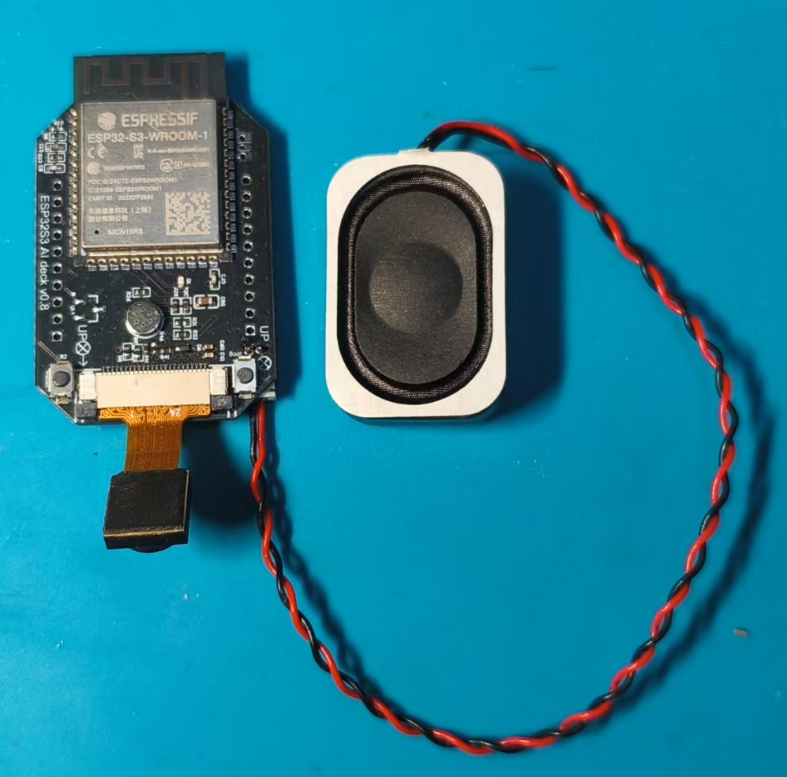
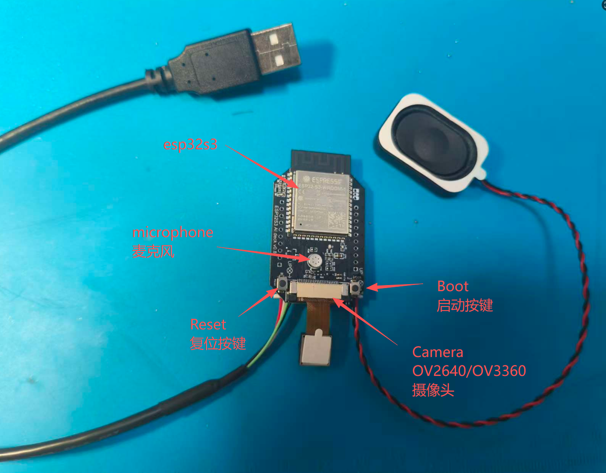
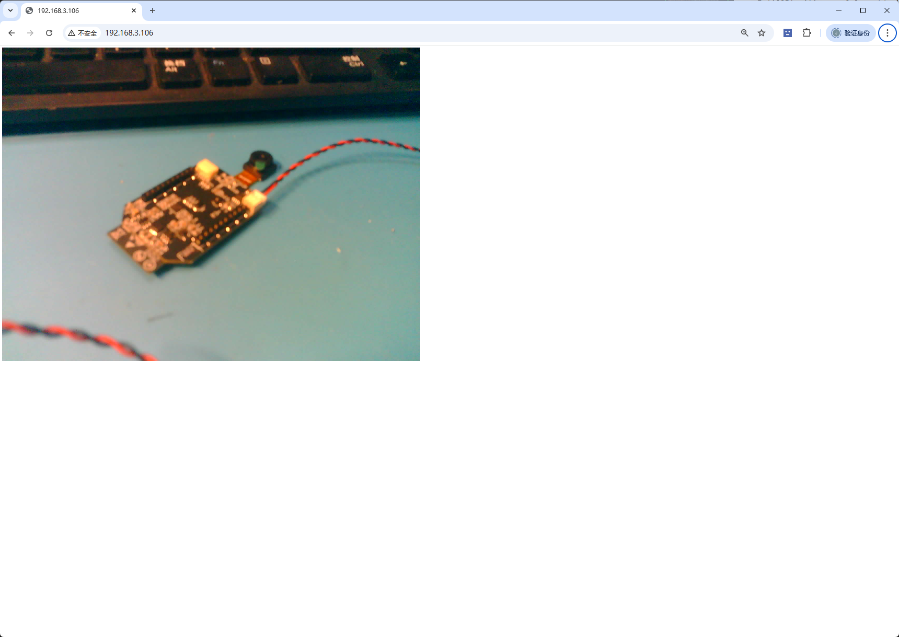

# esp32s3 ai deck

	esp32s3 ai deck support crazyflie platform based on Bitcraze

## hardware esp32s3 ai deck

## hardware -- esp32s3 ai deck + Crazyflie2.1

## windows install tool for compile

	esp-idf-tools all
	https://dl.espressif.cn/dl/esp-idf/?idf=4.4
	
	esp-idf-tools-setup-offline-5.2.exe
	https://github.com/espressif/idf-installer/releases/download/offline-5.2/esp-idf-tools-setup-offline-5.2.exe
	
	esp-idf-tools-setup-offline-5.5.exe
	https://github.com/espressif/idf-installer/releases/download/offline-5.5/esp-idf-tools-setup-offline-5.5.exe
	

## esp32s3 interface

## code

### esp32s3_ai_deck_allinone

- support ov2640 camera stream to Web HTTP Server
- support sample micphone data then play speaker

### esp32s3_camera_ov2640_stream

- support ov2640 camera stream to Web HTTP Server
  
### esp32s3_audio_i2s_es8311

- support audio play music
- support sample micphone data then play speaker 

## wifi config

	#define WIFI_SSID "HUAWEI-yang"
	#define WIFI_PASS "justinlee"

## esp32s3 compile and download command

	//create compile platform
	//建立编译环境
	idf.py fullclean
	idf.py set-target esp32s3
	idf.py menuconfig
	idf.py build

	//push Boot button, hold it then push Reset button, check the COM port, flash
	//先按住Boot按键，保持按住这个按键，然后按下Reset按键，然后设备管理器中查看端口号，最后执行如下指令烧录
	idf.py -p COM6 flash
	
	//COM monitor 115200
	//查看串口打印信息
	idf.py -p COM6 monitor
	
	//flash and COM monitor
	//下载和串口监控同时执行
	idf.py -p COM6 flash monitor

## esp32s3 flash tool download

	https://docs.espressif.com/projects/esp-test-tools/en/latest/esp32s3/production_stage/tools/flash_download_tool.html

## esp32s3_ai_deck_allinone camera stream to Web HTTP Server

- From UART log, get the ip address, open the browser, recommend Google Chrome browser, enter the IP address, and then press Enter
- 从串口log中查看获取的ip地址，打开浏览器，推荐google浏览器，输入ip地址，然后回车

	http://192.168.3.106/

Demo video

<video id="video" controls="" preload="none" poster="封面">
      <source id="mp4" src="media/esp32s3_camera_ov2640_allinone_test3.mp4" type="video/mp4">
</videos>

## esp32s3_ai_deck_allinone UART log

	E:\0_project\esp32s3_camera\code\esp32s3_ai_deck\esp32s3_ai_deck_allinone>idf.py -p COM81 flash
	Executing action: flash
	Running ninja in directory E:\0_project\esp32s3_camera\code\esp32s3_ai_deck\esp32s3_ai_deck_allinone\build
	Executing "ninja flash"...
	[1/5] C:\WINDOWS\system32\cmd.exe /C "cd /D E:\0_project\e...32s3_ai_deck_allinone/build/esp32s3_eye_ov2640_stream.bin"
	esp32s3_eye_ov2640_stream.bin binary size 0xe7a90 bytes. Smallest app partition is 0x100000 bytes. 0x18570 bytes (10%) free.
	[1/1] C:\WINDOWS\system32\cmd.exe /C "cd /D E:\0_project\e.../esp32s3_ai_deck_allinone/build/bootloader/bootloader.bin"
	Bootloader binary size 0x5260 bytes. 0x2da0 bytes (36%) free.
	[4/5] C:\WINDOWS\system32\cmd.exe /C "cd /D H:\esp32\Espre.../esp-idf-v5.5/components/esptool_py/run_serial_tool.cmake"
	esptool.py --chip esp32s3 -p COM81 -b 460800 --before=default_reset --after=hard_reset write_flash --flash_mode dio --flash_freq 80m --flash_size 2MB 0x0 bootloader/bootloader.bin 0x10000 esp32s3_eye_ov2640_stream.bin 0x8000 partition_table/partition-table.bin
	esptool.py v4.9.1
	Serial port COM81
	Connecting...
	Chip is ESP32-S3 (QFN56) (revision v0.2)
	Features: WiFi, BLE, Embedded PSRAM 8MB (AP_3v3)
	Crystal is 40MHz
	USB mode: USB-Serial/JTAG
	MAC: 30:ed:a0:1f:2f:d0
	Uploading stub...
	Running stub...
	Stub running...
	Changing baud rate to 460800
	Changed.
	Configuring flash size...
	Flash will be erased from 0x00000000 to 0x00005fff...
	Flash will be erased from 0x00010000 to 0x000f7fff...
	Flash will be erased from 0x00008000 to 0x00008fff...
	SHA digest in image updated
	Compressed 21088 bytes to 13422...
	Writing at 0x00000000... (100 %)
	Wrote 21088 bytes (13422 compressed) at 0x00000000 in 0.2 seconds (effective 774.1 kbit/s)...
	Hash of data verified.
	Compressed 948880 bytes to 575954...
	Writing at 0x00010000... (2 %)
	Writing at 0x0001d59e... (5 %)
	Writing at 0x00027d80... (8 %)
	Writing at 0x000309b4... (11 %)
	Writing at 0x0003b50a... (13 %)
	Writing at 0x00041194... (16 %)
	Writing at 0x00047725... (19 %)
	Writing at 0x0004db01... (22 %)
	Writing at 0x00054ea6... (25 %)
	Writing at 0x0005bfcf... (27 %)
	Writing at 0x00061ffe... (30 %)
	Writing at 0x000683c0... (33 %)
	Writing at 0x0006e25b... (36 %)
	Writing at 0x000741e5... (38 %)
	Writing at 0x00079482... (41 %)
	Writing at 0x0007e443... (44 %)
	Writing at 0x00083f6c... (47 %)
	Writing at 0x0008949b... (50 %)
	Writing at 0x0008e90b... (52 %)
	Writing at 0x00093e69... (55 %)
	Writing at 0x00099cad... (58 %)
	Writing at 0x0009faf6... (61 %)
	Writing at 0x000a5435... (63 %)
	Writing at 0x000ab02d... (66 %)
	Writing at 0x000b0d57... (69 %)
	Writing at 0x000b66ca... (72 %)
	Writing at 0x000bc3f1... (75 %)
	Writing at 0x000c2739... (77 %)
	Writing at 0x000c7e18... (80 %)
	Writing at 0x000ce2e4... (83 %)
	Writing at 0x000d8856... (86 %)
	Writing at 0x000de7cb... (88 %)
	Writing at 0x000e4e04... (91 %)
	Writing at 0x000eae68... (94 %)
	Writing at 0x000f124c... (97 %)
	Writing at 0x000f676d... (100 %)
	Wrote 948880 bytes (575954 compressed) at 0x00010000 in 5.0 seconds (effective 1533.5 kbit/s)...
	Hash of data verified.
	Compressed 3072 bytes to 103...
	Writing at 0x00008000... (100 %)
	Wrote 3072 bytes (103 compressed) at 0x00008000 in 0.0 seconds (effective 923.2 kbit/s)...
	Hash of data verified.

	Leaving...
	Hard resetting via RTS pin...
	Done

	E:\0_project\esp32s3_camera\code\esp32s3_ai_deck\esp32s3_ai_deck_allinone>idf.py -p COM81 monitor
	Executing action: monitor
	Running idf_monitor in directory E:\0_project\esp32s3_camera\code\esp32s3_ai_deck\esp32s3_ai_deck_allinone
	Executing "H:\esp32\Espressif\Espressif\python_env\idf5.5_py3.11_env\Scripts\python.exe H:\esp32\Espressif\Espressif\frameworks\esp-idf-v5.5\tools/idf_monitor.py -p COM81 -b 115200 --toolchain-prefix xtensa-esp32s3-elf- --target esp32s3 --revision 0 E:\0_project\esp32s3_camera\code\esp32s3_ai_deck\esp32s3_ai_deck_allinone\build\esp32s3_eye_ov2640_stream.elf E:\0_project\esp32s3_camera\code\esp32s3_ai_deck\esp32s3_ai_deck_allinone\build\bootloader\bootloader.elf --force-color -m 'H:\esp32\Espressif\Espressif\python_env\idf5.5_py3.11_env\Scripts\python.exe' 'H:\esp32\Espressif\Espressif\frameworks\esp-idf-v5.5\tools\idf.py' '-p' 'COM81'"...
	--- Warning: GDB cannot open serial ports accessed as COMx
	--- Using \\.\COM81 instead...
	--- esp-idf-monitor 1.7.0 on \\.\COM81 115200
	--- Quit: Ctrl+] | Menu: Ctrl+T | Help: Ctrl+T followed by Ctrl+H
	ESP-ROM:esp32s3-20210327
	Build:Mar 27 2021
	rst:0x15 (USB_UART_CHIP_RESET),boot:0x0 (DOWNLOAD(USB/UART0))
	Saved PC:0x40041a79
	--- 0x40041a79: ets_delay_us in ROM
	waiting for download
	--- Error: ClearCommError failed (PermissionError(13, '设备不识别此命令。', None, 22))
	--- Waiting for the device to reconnect.
	p_init: ESP-IDF:          v5.5
	I (807) efuse_init: Min chip rev:     v0.0
	I (811) efuse_init: Max chip rev:     v0.99
	I (815) efuse_init: Chip rev:         v0.2
	I (819) heap_init: Initializing. RAM available for dynamic allocation:
	I (825) heap_init: At 3FCA9908 len 0003FE08 (255 KiB): RAM
	I (830) heap_init: At 3FCE9710 len 00005724 (21 KiB): RAM
	I (835) heap_init: At 3FCF0000 len 00008000 (32 KiB): DRAM
	I (841) heap_init: At 600FE020 len 00001FC8 (7 KiB): RTCRAM
	I (846) esp_psram: Adding pool of 8192K of PSRAM memory to heap allocator
	I (853) spi_flash: detected chip: generic
	I (856) spi_flash: flash io: dio
	W (859) spi_flash: Detected size(16384k) larger than the size in the binary image header(2048k). Using the size in the binary image header.
	I (872) sleep_gpio: Configure to isolate all GPIO pins in sleep state
	I (878) sleep_gpio: Enable automatic switching of GPIO sleep configuration
	I (885) main_task: Started on CPU0
	I (895) esp_psram: Reserving pool of 32K of internal memory for DMA/internal allocations
	I (895) main_task: Calling app_main()
	I (895) AIO: Starting...
	I (925) pp: pp rom version: e7ae62f
	I (925) net80211: net80211 rom version: e7ae62f
	I (935) wifi:wifi driver task: 3fcb6324, prio:23, stack:6656, core=0
	I (945) wifi:wifi firmware version: f3dbad7
	I (945) wifi:wifi certification version: v7.0
	I (945) wifi:config NVS flash: enabled
	I (945) wifi:config nano formatting: disabled
	I (945) wifi:Init data frame dynamic rx buffer num: 32
	I (955) wifi:Init static rx mgmt buffer num: 5
	I (955) wifi:Init management short buffer num: 32
	I (955) wifi:Init dynamic tx buffer num: 32
	I (965) wifi:Init static tx FG buffer num: 2
	I (965) wifi:Init static rx buffer size: 1600
	I (975) wifi:Init static rx buffer num: 10
	I (975) wifi:Init dynamic rx buffer num: 32
	I (985) wifi_init: rx ba win: 6
	I (985) wifi_init: accept mbox: 6
	I (985) wifi_init: tcpip mbox: 32
	I (985) wifi_init: udp mbox: 6
	I (995) wifi_init: tcp mbox: 6
	I (995) wifi_init: tcp tx win: 5760
	I (995) wifi_init: tcp rx win: 5760
	I (1005) wifi_init: tcp mss: 1440
	I (1005) wifi_init: WiFi IRAM OP enabled
	I (1005) wifi_init: WiFi RX IRAM OP enabled
	W (1015) wifi:Password length matches WPA2 standards, authmode threshold changes from OPEN to WPA2
	I (1025) phy_init: phy_version 701,f4f1da3a,Mar  3 2025,15:50:10
	W (1025) phy_init: failed to load RF calibration data (0xffffffff), falling back to full calibration
	I (1065) phy_init: Saving new calibration data due to checksum failure or outdated calibration data, mode(2)
	I (1085) wifi:mode : sta (30:ed:a0:1f:2f:d0)
	I (1085) wifi:enable tsf
	I (1085) AIO: wifi_init_sta finished.
	I (1085) s3 ll_cam: DMA Channel=0
	I (1085) cam_hal: cam init ok
	I (1085) sccb-ng: pin_sda 4 pin_scl 5
	I (1095) sccb-ng: sccb_i2c_port=1
	I (1095) wifi:new:<6,0>, old:<1,0>, ap:<255,255>, sta:<6,0>, prof:1, snd_ch_cfg:0x0
	I (1105) wifi:state: init -> auth (0xb0)
	I (1115) camera: Camera PID=0x26 VER=0x42 MIDL=0x7f MIDH=0xa2
	I (1115) camera: Detected OV2640 camera
	I (1115) camera: Detected camera at address=0x30
	I (1145) wifi:state: auth -> assoc (0x0)
	I (1145) wifi:state: assoc -> run (0x10)
	I (1195) wifi:connected with HUAWEI-yang, aid = 3, channel 6, BW20, bssid = 22:84:d0:26:e7:53
	I (1195) wifi:security: WPA2-PSK, phy: bgn, rssi: -34
	I (1195) wifi:pm start, type: 1

	I (1195) wifi:dp: 1, bi: 102400, li: 3, scale listen interval from 307200 us to 307200 us
	I (1205) wifi:set rx beacon pti, rx_bcn_pti: 0, bcn_timeout: 25000, mt_pti: 0, mt_time: 10000
	I (1215) cam_hal: PSRAM DMA mode disabled
	I (1215) cam_hal: buffer_size: 16384, half_buffer_size: 1024, node_buffer_size: 1024, node_cnt: 16, total_cnt: 375
	I (1225) cam_hal: Allocating 384000 Byte frame buffer in PSRAM
	I (1235) cam_hal: Allocating 384000 Byte frame buffer in PSRAM
	I (1235) wifi:AP's beacon interval = 102400 us, DTIM period = 1
	I (1245) wifi:<ba-add>idx:0 (ifx:0, 22:84:d0:26:e7:53), tid:0, ssn:0, winSize:64
	I (1255) cam_hal: cam config ok
	I (1255) ov2640: Set PLL: clk_2x: 0, clk_div: 0, pclk_auto: 0, pclk_div: 12
	I (1335) AIO: Camera stream ready. Connect to http://<device_ip>/
	I (1335) AIO: i2s es8311 codec example start
	-----------------------------

	I (1335) AIO: i2s driver init success
	I (1355) ES8311: ES8311 in Slave mode and I2S format
	I (1365) AIO: es8311 codec init success
	I (1365) AIO: [echo] Echo start
	I (1365) main_task: Returned from app_main()
	I (2275) esp_netif_handlers: sta ip: 192.168.3.106, mask: 255.255.255.0, gw: 192.168.3.1
	

